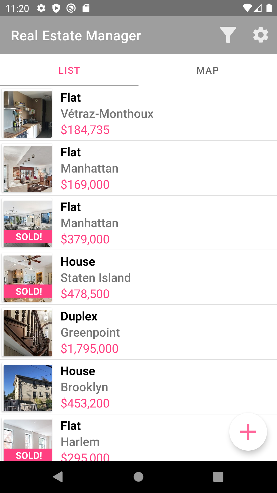
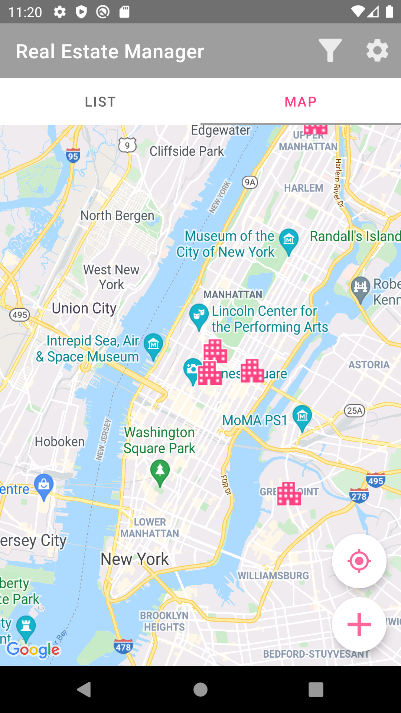
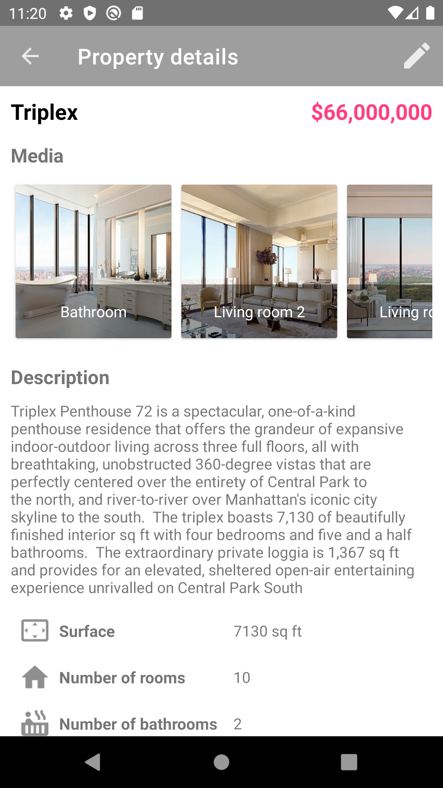
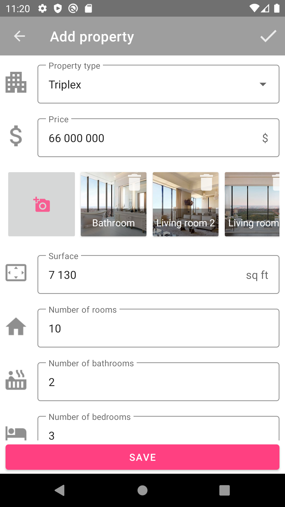
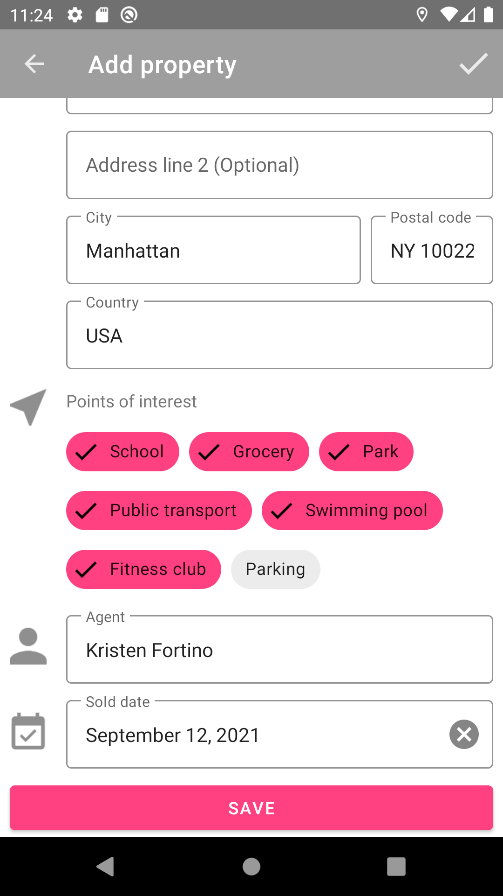
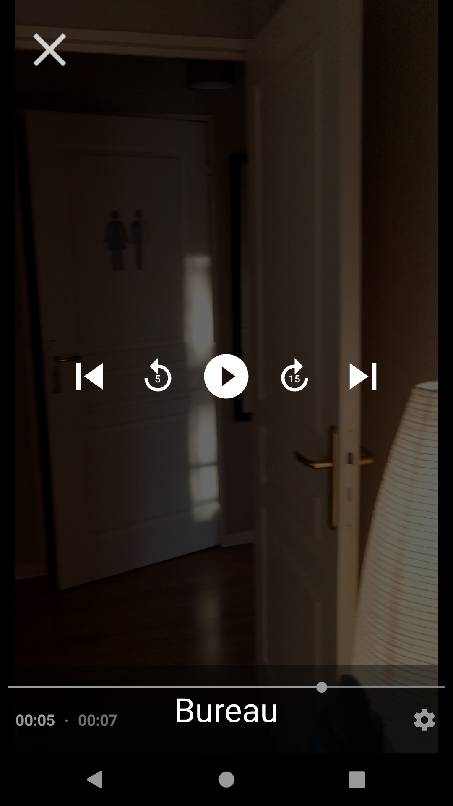
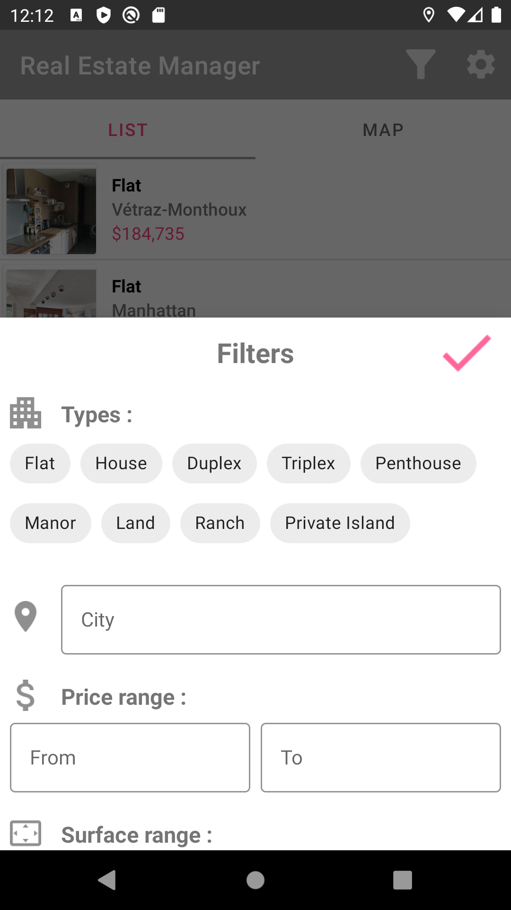
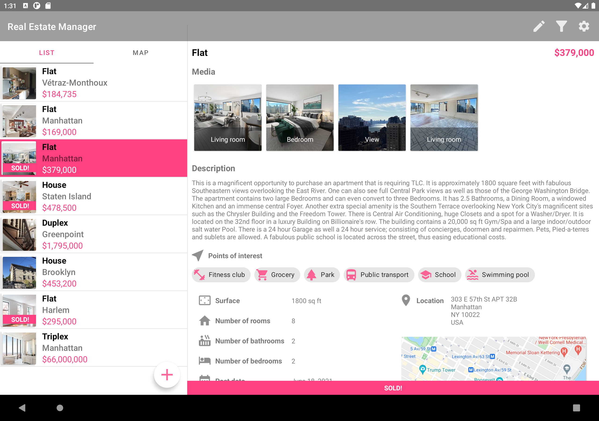

RealEstateManager is an Android application allowing agents to access real estate listings from their mobile devices, they can also add properties with pictures and videos.

This project uses:
- Kotlin
- Firebase firestore
- Firebase storage
- Room
- Glide
- Hilt
- MVVM architecture
- StateFlow
- Camera 1 API
- ExoPlayer
- PhotoView
- Content Provider
- Orientation Service
- Turbine
- Mockito
- Truth

***

